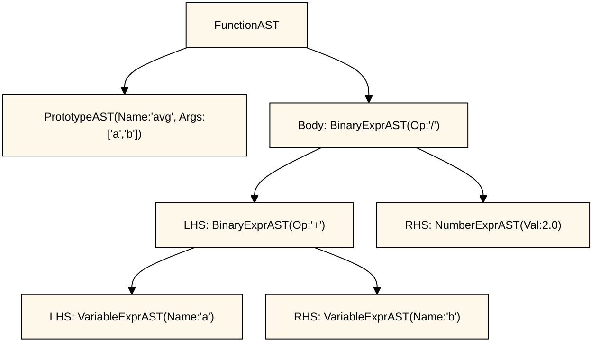
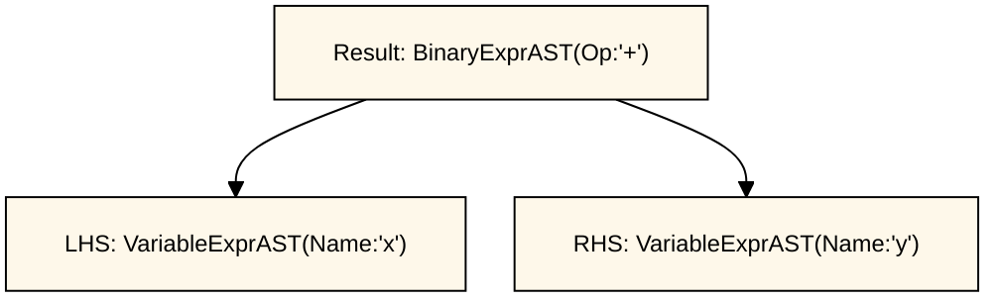
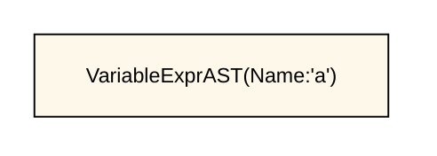
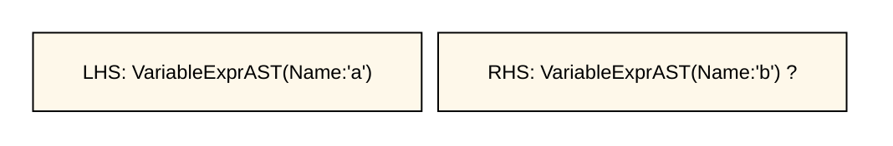
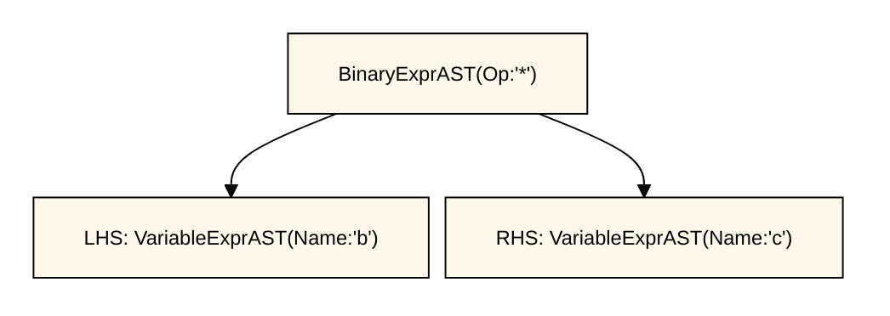
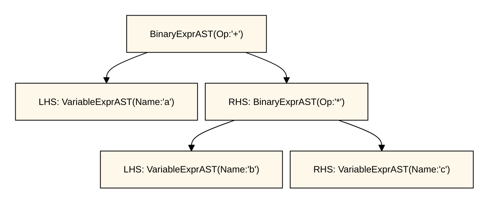
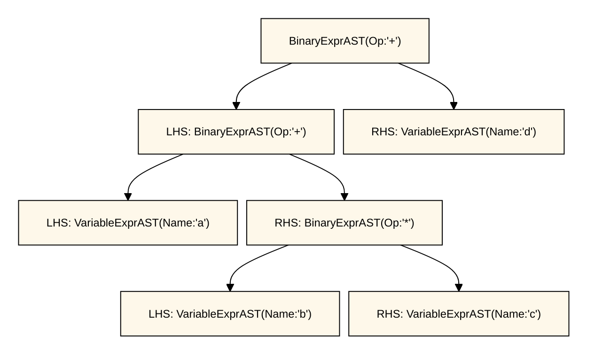

# 2. Pyxc: Implementing a Parser and AST

## Introduction
Welcome to Chapter 2 of the [Pyxc: My First Language Frontend with LLVM](chapter-00.md) tutorial. This chapter shows you how to use the lexer, built in [Chapter 1](chapter-01.md), to build a full parser for our Pyxc language. Once we have a [parser](http://en.wikipedia.org/wiki/Parsing), we’ll define and build an [Abstract Syntax Tree](http://en.wikipedia.org/wiki/Abstract_syntax_tree) (AST). Don't worry if these terms seem alien to you at the moment. Everything will be explained in time. 

## Source Code

To follow along you can download the code from GitHub [pyxc-llvm-tutorial](https://github.com/alankarmisra/pyxc-llvm-tutorial) or you can see the full source code here [code/chapter02](https://github.com/alankarmisra/pyxc-llvm-tutorial/tree/main/code/chapter02).

## It's Grammar Time

Before we try and parse the language, we should have an idea of what we are trying to parse. We can start at the top (the `program`) and then, little by little, break it down into components parts.

For text we want to match exactly (`keywords`), we put it in quotes. For text that follows a pattern, such as variable names, we describe it with a regular expression.

For things built from other things, we write `productions` like this:

```ebnf
thing = "keyword" other_thing "keyword" other_other_thing
```

We call it a `production` because it specifies how that grammar symbol is produced (derived).

The `thing` before the equality sign is the `production` symbol. The `other_thing` would have its own production below, and `other_other_thing` would too. If we keep going, every production eventually reduces to either exact text (a `keyword`) or a unit of text that matches a regular expression pattern.

When we build the parser, we can have a `ParseThing` for every `thing`. So we can have `ParseThing`, `ParseTheOtherThing`, `ParseTheOtherOtherThing`. Ok enough `things`. Let's get concrete. Here's what our grammar looks like right now. This style of writing down productions is called [EBNF](https://en.wikipedia.org/wiki/Extended_Backus%E2%80%93Naur_form).

### A key to unlocking EBNF Grammar

- `production`: the name on the left side of `=`. It defines what that piece of the language looks like.
- `"keyword"`: text in quotes means `match this exact text`.
- `regexp`: a pattern that matches text with a shape (for example, an identifier or a number).
- `[ ... ]`: optional. This part may appear once, or not at all.
- `( ... )`: grouping. Use this to bundle pieces together so they are treated as one unit.
- `{ ... }`: repeat zero or more times.
- `(* ... *)`: comment

```ebnf
program        = { mainloop } 

(* MainLoop() *)
mainloop         = definition 
                 | external 
                 | expression 
                 | newline

(* ParseDefinition() *)
definition     = "def" prototype ":" expression 
(* ParseExtern() *)
external       = "extern" "def" prototype 
 (* ParseTopLevelExpression() *)
toplevelexpr   = expression
(* ParsePrototype() *)
prototype      = identifier "(" [ identifier { "," identifier } ] ")" 
(* ParseExpression() *)
expression     = primary { binoprhs } 
(* ParsePrimary() *)
primary        = identifierexpr
                 | numberexpr
                 | parenexpr
(* ParseIdentifierExpr() *)
identifierexpr = identifier
                 | identifier "(" [ expression { "," expression } ] ")"
(* ParseNumberExpr() *)
numberexpr     = number
(* ParseParenExpr() *)
parenexpr      = "(" expression ")"
(* ParseBinOpRHS() *)
binoprhs       = binaryop primary

(* gettok() / Regex-style terminals *)
newline        = "\n" (* `\r` and `\r\n` are normalized to `\n` *)
binaryop       = "<" | "+" | "-" | "*"
identifier     = /[A-Za-z_][A-Za-z0-9_]*/
number         = /[0-9]+(\.[0-9]+)?/
```

## Which mainloop option do we pick?
In:

```ebnf
mainloop         = definition
                 | external
                 | expression
```

how do we choose which branch to parse?

We look at the first token (with one-token lookahead):

- `definition` starts with `def`.
- `external` starts with `extern`.
- `expression` starts with whatever a `primary` starts with (`identifier`, `number`, or `(`).

Those starting tokens are distinct, so the parser can choose immediately with no backtracking. We designed the language this way on purpose to keep parsing simple.

The formal name for this style is `LL(1)`. Around here, we can call it `One Punch (token)` parsing.

## A simple gotcha

One `thing` to watch out for while writing grammar productions (no pun intended) is definitions like:

```ebnf
thing = thing "+" other_thing
```

This creates an infinite `thing` loop. Our grammar does not have this issue right now, so we will not dwell on it here. It is just something to keep in mind when you get into formal grammar theory. We can however refer to `thing` more than once.

```ebnf
thing = "+" thing
```
The above is fine. It will keep reading until it lands up on something that's not a `+`.

## Recursive Descent Parsing

Since we start at the top symbol/production, descend into the productions that make it up, and eventually encounter recursion (`things` made up of more `things`), we call it [Recursive Descent Parsing](http://en.wikipedia.org/wiki/Recursive_descent_parser). That is about all there is to this highly technical term.

## Operator Precedence Parsing

[Operator-Precedence Parsing](http://en.wikipedia.org/wiki/Operator-precedence_parser) allows us to decide that

```python
a + b * c
```

should be read as

```python
a + (b * c)
```

`+` and `*` are operators. `*` has higher precedence (a higher ranking) than `+`, so we must evaluate `*` before `+`. Hence `Operator` `Precedence` Parsing.

## Is it just me?
Dense words tend to confuse me, so I look at the taxonomy of things to remember why something is called what it is. If you have done any level of math, you know this can [backfire](https://en.wikipedia.org/wiki/Grothendieck%E2%80%93Riemann%E2%80%93Roch_theorem). But we try.

## The Abstract Syntax Tree (AST)

The AST for a program captures its behavior in such a way that it is easy for later stages of the compiler (e.g. code generation) to interpret. We basically want one object for each construct in the language, and the AST should closely model the language. 

For example, for:

```python
def avg(a, b):
    return (a + b)/2.0 
```

the AST shape in Chapter 2 looks like this:




### What's so abstract about Abstract Syntax Trees?

`Abstract` in this context means we keep only the structure and meaning of the code, and drop syntax that was inserted only to guide parsing it. 

For example, parentheses help with grouping while parsing, but once grouping is understood, we can throw the `(` and `)` tokens away and group the parenthesized expressions into a common parent as shown above where `BinaryExprAST` groups the operands.

Let's start transcribing this to code:

```cpp
/// ExprAST - Base class for all expression nodes.
class ExprAST {
public:
  virtual ~ExprAST() = default;
};

/// NumberExprAST - Expression class for numeric literals like "1.0".
class NumberExprAST : public ExprAST {
  double Val;

public:
  NumberExprAST(double Val) : Val(Val) {}
};
```

The code above shows the definition of the base `ExprAST` class and one subclass which we use for numeric literals. The `NumberExprAST` class captures the numeric value of the literal as an instance variable. This allows later phases of the compiler to know what the stored numeric value is.

Here are the other expression AST node definitions that we’ll use in the basic form of the Pyxc language:

```cpp
/// VariableExprAST - Expression class for referencing a variable, like "a".
class VariableExprAST : public ExprAST {
  string Name;

public:
  VariableExprAST(const string &Name) : Name(Name) {}
};

/// BinaryExprAST - Expression class for a binary operator.
class BinaryExprAST : public ExprAST {
  char Op;
  unique_ptr<ExprAST> LHS, RHS;

public:
  BinaryExprAST(char Op, unique_ptr<ExprAST> LHS,
                unique_ptr<ExprAST> RHS)
    : Op(Op), LHS(std::move(LHS)), RHS(std::move(RHS)) {}
};

/// CallExprAST - Expression class for function calls.
class CallExprAST : public ExprAST {
  string Callee;
  vector<unique_ptr<ExprAST>> Args;

public:
  CallExprAST(const string &Callee,
              vector<unique_ptr<ExprAST>> Args)
    : Callee(Callee), Args(std::move(Args)) {}
};
```

This is all (intentionally) rather straight-forward: variables capture the variable name, binary operators capture their opcode (e.g. `+`), and calls capture a function name as well as a list of any argument expressions.

For our basic language, these are all of the expression nodes we’ll define. The two things we need next are a way to talk about the interface to a function, and a way to talk about functions themselves:

```cpp
/// PrototypeAST - This class represents the "prototype" for a function,
/// which captures its name, and its argument names (thus implicitly the number
/// of arguments the function takes).
class PrototypeAST {
  string Name;
  vector<string> Args;

public:
  PrototypeAST(const string &Name, vector<string> Args)
    : Name(Name), Args(std::move(Args)) {}

  const string &getName() const { return Name; }
};

/// FunctionAST - This class represents a function definition itself.
class FunctionAST {
  unique_ptr<PrototypeAST> Proto;
  unique_ptr<ExprAST> Body;

public:
  FunctionAST(unique_ptr<PrototypeAST> Proto,
              unique_ptr<ExprAST> Body)
    : Proto(std::move(Proto)), Body(std::move(Body)) {}
};
```

In Pyxc, the function prototype only stores the name and the number of parameters without any parameter types. When we eventually introduce types, we will store them along with the parameters. It will allow us to distinguish between foo(int) and foo(string) i.e. we can have some good old-fashioned function overloading. 

With these basics in place, we can now talk about parsing expressions and function bodies in Pyxc.

## Parser Basics
Now that we have an AST to build, we need to define the parser code to build it. The idea here is that we want to parse something like `x+y` (which is returned as three tokens by the lexer) into an AST that could be generated with calls like this:

```cpp
auto LHS = make_unique<VariableExprAST>("x");
auto RHS = make_unique<VariableExprAST>("y");
auto Result = make_unique<BinaryExprAST>('+', std::move(LHS), std::move(RHS));
```




In order to do this, we’ll start by defining some basic helper routines:

```cpp
/// CurTok/getNextToken - Provide a simple token buffer.  CurTok is the current
/// token the parser is looking at.  getNextToken reads another token from the
/// lexer and updates CurTok with its results.
static int CurTok;
static int getNextToken() {
  return CurTok = gettok();
}
```

This implements a simple token buffer around the lexer. This allows us to look one token ahead at what the lexer is returning. Every function in our parser will assume that CurTok is the current token that needs to be parsed.

```cpp
using ExprPtr = unique_ptr<ExprAST>;
using ProtoPtr = unique_ptr<PrototypeAST>;
using FuncPtr = unique_ptr<FunctionAST>;

...

template <typename T = void> T LogError(const char *Str) {
  const string TokStr = FormatTokenForError(CurTok);
  fprintf(stderr, "%sError%s: (Line: %d, Column: %d): %s near %s\n", Red, Reset,
          CurLoc.Line, CurLoc.Col, Str, TokStr.c_str());
  PrintErrorSourceContext(CurLoc);
  if constexpr (is_void_v<T>)
    return;
  else if constexpr (is_pointer_v<T>)
    return nullptr;
  else
    return T{};
}

```

This template helper gives us one error-reporting function for all parser return types. When we call it, we choose the return type (`LogError<ExprPtr>`(...), `LogError<ProtoPtr>`(...), etc.), and the helper returns an empty value of that type. It also supports void calls (`LogError`(...) with no template argument).
In that case, it just reports the error and returns normally.

```cpp
static string FormatTokenForError(int Tok) {
  if (Tok == tok_identifier)
    return "identifier '" + IdentifierStr + "'";
  if (Tok == tok_number)
    return "number '" + NumLiteralStr + "'";

  const auto TokIt = TokenNames.find(Tok);
  if (TokIt != TokenNames.end())
    return TokIt->second;
  return "unknown token";
}
```

`FormatTokenForError` converts the current token into a user friendly string. For identifiers and numbers, it includes the captured string (`lexeme` in linguistics parlance) so errors can say exactly what was seen. For other tokens, it falls back to the shared TokenNames table, and if no mapping exists, it returns "unknown token".

```cpp
static void PrintErrorSourceContext(SourceLocation Loc) {
  const string *LineText = SourceMgr.getLine(Loc.Line);
  if (!LineText)
    return;

  fprintf(stderr, "%s\n", LineText->c_str());

  int Spaces = Loc.Col - 1;
  if (Spaces < 0)
    Spaces = 0;
  for (int I = 0; I < Spaces; ++I)
    fputc(' ', stderr);
  fprintf(stderr, "%s^%s", Bold, Reset);
  fputc('~', stderr);
  fputc('~', stderr);
  fputc('~', stderr);
  fputc('\n', stderr);
}
```

`PrintErrorSourceContext` prints source context for an error location: first the full source line, then a caret-and-underline marker aligned to the reported column. It uses SourceMgr to fetch the line text and gracefully does nothing if that line is unavailable. The `^~~~` marker gives a fast visual pointer to where parsing failed.

With these basic helper functions, we can implement the first piece of our grammar: numeric literals.

## Basic Expression Parsing

We start with numeric literals, because they are the simplest to process. For each production in our grammar, we’ll define a function which parses that production. For numeric literals, we have:

```cpp
/// numberexpr = number
static unique_ptr<ExprAST> ParseNumberExpr() {
  auto Result = make_unique<NumberExprAST>(NumVal);
  getNextToken(); // consume the number
  return std::move(Result);
}
```

The routine expects to be called when the current token is a `tok_number` token. It takes the current number value, creates a `NumberExprAST` node, advances the lexer to the next token, and finally returns.

The routine eats all of the tokens that correspond to the production and returns with the lexer sitting on the NEXT token ready to go. This is a fairly standard way to go for recursive descent parsers. The parenthesis operator is defined like this:

```cpp
/// parenexpr = '(' expression ')'
static unique_ptr<ExprAST> ParseParenExpr() {
  getNextToken(); // eat (.
  auto V = ParseExpression();
  if (!V)
    return nullptr;

  if (CurTok != ')')
    return LogError<ExprPtr>("expected ')'");
  getNextToken(); // eat ).

  // The lexer is now sitting on the token AFTER ')'
  // ie the entire parenexpr production has been eaten.
  return V;
}
```

This function illustrates a number of notable things about the parser:

1) Because errors can occur, the parser needs a way to indicate that they happened: in our parser, we print the error, and return an empty pointer. 

2) Parentheses do not cause construction of AST nodes themselves. While we could do it this way, the most important role of parentheses are to guide the parser and provide grouping. Once the parser constructs the AST, parentheses are not needed and parentheses tokens are discarded.

The next simple production is for handling variable references and function calls:

```cpp
/// identifierexpr
///   = identifier
///   = identifier '(' [ expression { ',' expression } ] ')'
static unique_ptr<ExprAST> ParseIdentifierExpr() {
  string IdName = IdentifierStr;

  getNextToken();  // eat identifier.

  if (CurTok != '(') // simple variable ref.
    return make_unique<VariableExprAST>(IdName);

  // Call.
  getNextToken();  // eat (
  vector<unique_ptr<ExprAST>> Args;
  if (CurTok != ')') {
    while (true) {
      if (auto Arg = ParseExpression())
        Args.push_back(std::move(Arg));
      else
        return nullptr;

      if (CurTok == ')')
        break;

      if (CurTok != ',')
        return LogError<ExprPtr>("Expected ')' or ',' in argument list");
      getNextToken();
    }
  }

  // Eat the ')'.
  getNextToken();

  return make_unique<CallExprAST>(IdName, std::move(Args));
}
```

This routine follows the same style as the other routines. (It expects to be called if the current token is a `tok_identifier` token). It also has recursion and error handling. It uses look-ahead to determine if the current identifier is a stand alone variable reference or if it is a function call expression. It handles this by checking to see if the token after the identifier is a `(` token, constructing either a `VariableExprAST` or `CallExprAST` node as appropriate.

Now that we have all of our simple expression-parsing logic in place, we can define a helper function to wrap it together into one entry point. We call this class of expressions `primary` expressions. In order to parse an arbitrary primary expression, we need to determine what sort of expression it is:

```cpp
/// primary
///   = identifierexpr
///   | numberexpr
///   | parenexpr
static unique_ptr<ExprAST> ParsePrimary() {
  switch (CurTok) {
  case tok_identifier:
    return ParseIdentifierExpr();
  case tok_number:
    return ParseNumberExpr();
  case '(':
    return ParseParenExpr();
  default:
    return LogError<ExprPtr>("unknown token when expecting an expression");
  }
}
```
We use the unprocessed CurTok to determine which sort of expression is being inspected, and then parses it with a function call which consumes the entire expression and leaves CurTok pointing to the next unprocessed token and so on.

Now that basic expressions are handled, we need to handle binary expressions. They are a bit more complex.

## Binary Expression Parsing
Binary expressions can be read in more than one way.  
For example, `x+y*z` could be grouped as `(x+y)*z` or `x+(y*z)`.

By PEMDAS/BODMAS rules, `*` is processed before `+`, so the expected grouping is `x+(y*z)`.

To encode this behavior, we use an operator precedence table, which tells the parser which operator should be processed first. Higher numbers mean earlier processing; lower numbers mean later processing.

```cpp
/// BinopPrecedence - This holds the precedence for each 
// binary operator that is defined. So left-to-right, 
// all the *'s are processed first
// then `+` and `-` 
// and finally '<'
static map<char, int> BinopPrecedence = {
    {'<', 10}, {'+', 20}, {'-', 20}, {'*', 40}};
```
We define a few convenience constants.

```cpp
static constexpr int NO_OP_PREC = -1;
static constexpr int MIN_BINOP_PREC = 1; // one higher than NO_OP_PREC
```

And, for the sake of explanation, we we define additional constants. These constants are NOT in the actual code and are only included here for illustration purposes.

```cpp
constexpr int LT_PREC = 10;
constexpr int ADD_PREC = 20;
constexpr int SUB_PREC = 20;
constexpr int MUL_PREC = 40;
```

Next we write a helper function to determine the precedence of a binary operator.

```cpp
/// GetTokPrecedence - Get the precedence of the pending binary operator token.
static int GetTokPrecedence() {
  // No Unicode complexities for now.
  if (!isascii(CurTok))
    return NO_OP_PREC;

  // Make sure it's a declared binop.
  int TokPrec = BinopPrecedence[CurTok];
  if (TokPrec < MIN_BINOP_PREC)
    return NO_OP_PREC;
  return TokPrec;
}
```

For the basic form of Pyxc, we will only support 4 binary operators (this can obviously be extended by you, our brave and intrepid reader). The `GetTokPrecedence` function returns the precedence for the current token, or NO_OP_PREC (*-1*) if the token is not a binary operator. 

### Example 1. "a"
Let's see how we would parse a simple single-item expression like: 
`a`

```cpp
/// expression
///   = primary binoprhs
///
static unique_ptr<ExprAST> ParseExpression() {
  auto LHS = ParsePrimary();
  if (!LHS)
    return nullptr;
  // Only parse further if the next token is a BinOp
  return ParseBinOpRHS(MIN_BINOP_PREC, std::move(LHS));
}
```

For input `a`, `ParsePrimary()` parses it as a variable expression node (for example, `VariableExprAST("a")`). 

Now we have one node:

<div style="width: 300px; margin: 0 auto;">



</div>


Then `ParseExpression()` calls:

```cpp
ParseBinOpRHS(ANY_OP_PREC, std::move(LHS))
```

Here's the `ParseBinOpRHS` function.

```cpp
/// binoprhs
///   = ('+' primary)*
static unique_ptr<ExprAST> ParseBinOpRHS(int MinimumPrec,
                                              unique_ptr<ExprAST> LHS) {
  while (true) {
    int TokPrec = GetTokPrecedence();

    // In the first call 
    // ParseBinOpRHS(MIN_BINOP_PREC, ...)
    // this will be true only if the next token
    // is a BinOp. Otherwise it will return.
    if (TokPrec < MinimumPrec)
      return LHS;
```

At that point, there is no binary operator after `a`, so `GetTokPrecedence()` returns `NO_OP_PREC`.  
`ParseBinOpRHS` sees that this is below the required minimum precedence (MinimumPrec) and immediately returns `LHS` unchanged.

So the final result is just the AST node for `a`, with no binary-expression wrapping.

### Example 2. "a + b * c + d"

We know this should be interpreted as `a + (b * c) + d`.

Let's run `a + b * c + d` through the code like before.

`ParseExpression()` first consumes `a` with `ParsePrimary()`, so:
- `LHS = VarExprAST("a")`
- remaining input: `+ b * c + d`

<div style="width: 300px; margin: 0 auto;">


</div>

Now we enter:
```cpp
ParseBinOpRHS(MIN_BINOP_PREC, std::move(LHS))
```

### Outer call: consume the first `+`

```cpp
// State on entry:
//   input      = + b * c + d
//   MinimumPrec = MIN_BINOP_PREC (1)
//   LHS        = VarExprAST("a")
int TokPrec = GetTokPrecedence();    // TokPrec = ADD_PREC
if (TokPrec < MinimumPrec)           // ADD_PREC < MIN_BINOP_PREC ? false
  return LHS;

int BinOp = CurTok;                  // BinOp = '+'
getNextToken();                      // eat '+', input -> b * c + d

auto RHS = ParsePrimary();           // RHS = VarExprAST("b"), input -> * c + d
if (!RHS)
  return nullptr;
```

At this point, we have:
- outer `BinOp = '+'`
- `LHS = a`
- tentative `RHS = b`
- lookahead operator is `*`

<div>



</div>

### Why recursion happens

```cpp
// State:
//   TokPrec  = ADD_PREC
//   input    = * c + d
int NextPrec = GetTokPrecedence();   // NextPrec = MUL_PREC

if (TokPrec < NextPrec) {            // ADD_PREC < MUL_PREC -> true
  const int HigherPrecThanCurrent = TokPrec + 1; // 21
  RHS = ParseBinOpRHS(HigherPrecThanCurrent, std::move(RHS));
  if (!RHS)
    return nullptr;
}
```

This recursive call starts with:
- `MinimumPrec = 21`
- `LHS = b`
- input: `* c + d`

### Recursive call: build `b * c`

```cpp
// Recursive state on entry:
//   input      = * c + d
//   MinimumPrec = 21
//   LHS        = VarExprAST("b")
int TokPrec = GetTokPrecedence();    // TokPrec = MUL_PREC (40)
if (TokPrec < MinimumPrec)           // 40 < 21 ? false
  return LHS;

int BinOp = CurTok;                  // BinOp = '*'
getNextToken();                      // eat '*', input -> c + d

auto RHS = ParsePrimary();           // RHS = VarExprAST("c"), input -> + d
if (!RHS)
  return nullptr;

int NextPrec = GetTokPrecedence();   // NextPrec = ADD_PREC (20)
if (TokPrec < NextPrec) {            // 40 < 20 ? false
  ...
}

LHS = make_unique<BinaryExprAST>(BinOp, std::move(LHS), std::move(RHS));
// LHS is now BinOp('*', b, c)
```

<div>



</div>

Loop once more in recursion:

```cpp
int TokPrec = GetTokPrecedence();    // TokPrec = ADD_PREC (20)
if (TokPrec < MinimumPrec)           // 20 < 21 ? true
  return LHS;                        // returns BinOp('*', b, c)
```

So recursion returns `RHS = (b * c)` to the outer call.

### Back in the outer call: merge `a + (b * c)`

```cpp
// Outer state after recursion:
//   BinOp = '+'
//   LHS   = VarExprAST("a")
//   RHS   = BinOp('*', b, c)
LHS = make_unique<BinaryExprAST>(BinOp, std::move(LHS), std::move(RHS));
// LHS is now BinOp('+', a, (b*c))
```

<div>



</div>

Input is still: `+ d`

### Outer loop continues: consume `+ d`

```cpp
int TokPrec = GetTokPrecedence();    // TokPrec = ADD_PREC
if (TokPrec < MinimumPrec)           // ADD_PREC < MIN_BINOP_PREC ? false
  return LHS;

int BinOp = CurTok;                  // BinOp = '+'
getNextToken();                      // eat '+', input -> d

auto RHS = ParsePrimary();           // RHS = VarExprAST("d"), input -> <end>
if (!RHS)
  return nullptr;

int NextPrec = GetTokPrecedence();   // NextPrec = NO_OP_PREC
if (TokPrec < NextPrec) {            // ADD_PREC < NO_OP_PREC ? false
  ...
}

LHS = make_unique<BinaryExprAST>(BinOp, std::move(LHS), std::move(RHS));
// LHS is now BinOp('+', BinOp('+', a, (b*c)), d)
```

### Outer loop exits

```cpp
int TokPrec = GetTokPrecedence();    // TokPrec = NO_OP_PREC
if (TokPrec < MinimumPrec)           // NO_OP_PREC < MIN_BINOP_PREC ? true
  return LHS;
```

Final result:
`BinOp('+', BinOp('+', a, BinOp('*', b, c)), d)`

Equivalent grouping:
`(a + (b * c)) + d`

<div>



</div>


## Parsing the Rest
The next thing missing is handling of function prototypes. In Pyxc, these are used both for `extern` function declarations as well as function body definitions. The code to do this is straight-forward:

```cpp
/// prototype
///   = identifier '(' [ identifier { ',' identifier } ] ')'
static unique_ptr<PrototypeAST> ParsePrototype() {
  if (CurTok != tok_identifier)
    return LogError<ProtoPtr>("Expected function name in prototype");

  string FnName = IdentifierStr;
  getNextToken();

  if (CurTok != '(')
    return LogError<ProtoPtr>("Expected '(' in prototype");

  vector<string> ArgNames;
  while (getNextToken() == tok_identifier) {
    ArgNames.push_back(IdentifierStr);
    getNextToken(); // eat identifier

    if (CurTok == ')')
      break;

    if (CurTok != ',')
      return LogError<ProtoPtr>("Expected ')' or ',' in parameter list");
  }

  if (CurTok != ')')
    return LogError<ProtoPtr>("Expected ')' in prototype");

  // success.
  getNextToken(); // eat ')'.

  return make_unique<PrototypeAST>(FnName, std::move(ArgNames));
}
```

Given this, a function definition is very simple, just a prototype plus an expression to implement the body:

```cpp
/// definition = 'def' prototype ':' expression
static unique_ptr<FunctionAST> ParseDefinition() {
  getNextToken(); // eat def.

  auto Proto = ParsePrototype();
  if (!Proto)
    return nullptr;

  if (CurTok != ':')
    return LogError<FuncPtr>("Expected ':' in function definition");
  getNextToken(); // eat ':'

  // This takes care of a situation where we decide to split the
  // function and expression
  // ready> def foo(x):
  // ready>  return x + 1
  while (CurTok == tok_eol)
    getNextToken();

  if (CurTok != tok_return)
    return LogError<FuncPtr>("Expected 'return' before return expression");
  getNextToken(); // eat return

  if (auto E = ParseExpression())
    return make_unique<FunctionAST>(std::move(Proto), std::move(E));
  return nullptr;
}
```

In addition, we support `extern` to declare functions like `sin` and `cos` as well as to support forward declaration of user functions. These `extern`s are just prototypes with no body:

```cpp
/// external = 'extern' 'def' prototype
static unique_ptr<PrototypeAST> ParseExtern() {
  getNextToken(); // eat extern.
  if (CurTok != tok_def)
    return LogError<ProtoPtr>("Expected `def` after extern.");
  getNextToken(); // eat def
  return ParsePrototype();
}
```
Finally, we’ll also let the user type in arbitrary top-level expressions and evaluate them on the fly. We will handle this by defining anonymous nullary (zero argument) functions for them:

```cpp
/// toplevelexpr = expression
static unique_ptr<FunctionAST> ParseTopLevelExpr() {
  if (auto E = ParseExpression()) {
    // Make an anonymous proto.
    auto Proto = make_unique<PrototypeAST>("__anon_expr", vector<string>());
    return make_unique<FunctionAST>(std::move(Proto), std::move(E));
  }
  return nullptr;
}
```

## Error Handling at the top level

```cpp
static void SynchronizeToLineBoundary() {
  while (CurTok != tok_eol && CurTok != tok_eof)
    getNextToken();
}

static void SynchronizeToLineBoundary() {
  while (CurTok != tok_eol && CurTok != tok_eof)
    getNextToken();
}

static void HandleDefinition() {
  if (ParseDefinition()) {
    if (CurTok != tok_eol && CurTok != tok_eof) {
      string Msg = "Unexpected " + FormatTokenForMessage(CurTok);
      LogError<void>(Msg.c_str());
      SynchronizeToLineBoundary();
      return;
    }
    fprintf(stderr, "Parsed a function definition\n");
  } else {
    // Error recovery: skip the rest of the current line so leftover tokens
    // from a malformed construct don't get parsed as a new top-level form.
    SynchronizeToLineBoundary();
  }
}

static void HandleExtern() {
  if (ParseExtern()) {
    if (CurTok != tok_eol && CurTok != tok_eof) {
      string Msg = "Unexpected " + FormatTokenForMessage(CurTok);
      LogError<void>(Msg.c_str());
      SynchronizeToLineBoundary();
      return;
    }
    fprintf(stderr, "Parsed an extern\n");
  } else {
    SynchronizeToLineBoundary();
  }
}

static void HandleTopLevelExpression() {
  // Evaluate a top-level expression into an anonymous function.
  if (ParseTopLevelExpr()) {
    if (CurTok != tok_eol && CurTok != tok_eof) {
      string Msg = "Unexpected " + FormatTokenForMessage(CurTok);
      LogError<void>(Msg.c_str());
      SynchronizeToLineBoundary();
      return;
    }
    fprintf(stderr, "Parsed a top-level expr\n");
  } else {
    SynchronizeToLineBoundary();
  }
}
```

If a top-level form parses successfully, we only print "Parsed ..." when it also ends cleanly at a line boundary ie on a newline or end-of-file. If extra tokens remain on that same line, we report an "Unexpected <token>" error and recover. If parsing fails earlier, one of the `Parse*` functions reports the error. In both cases, the top-level handler calls `SynchronizeToLineBoundary()`, which skips the rest of the current line so leftover input cannot be misinterpreted as a new top-level construct, preventing cascading errors.

Now that we have all the pieces, let’s build a little driver that will let us actually execute this code we’ve built!

## The Driver
The driver now invokes the parser through a top-level dispatch loop. We removed the Chapter 1 token-printing loop for now. We will bring token-stream mode back later, after LLVM setup, with command-line switches (for example, parse-only vs token-print).

```cpp
/// mainloop = definition | external | expression | eol
static void MainLoop() {
  while (true) {
    // Don't print a prompt when we already know we're at EOF.
    if (CurTok == tok_eof)
      return;

    fprintf(stderr, "ready> ");
    switch (CurTok) {
    case tok_eol: // Skip newlines
      getNextToken();
      continue;
    case tok_def:
      HandleDefinition();
      break;
    case tok_extern:
      HandleExtern();
      break;
    default:
      HandleTopLevelExpression();
      break;
    }
  }
}
```

Note that, as with Python, this is not legal:
```python
4 + 5
* 6
```
In Python you could put the entire expression in delimiters or use an explicit continuation character `\`. We don't implement that just yet. 

## Compiling

```bash
cd code/chapter05 && ./build.sh
```

## Sample interaction

```python
$ build/pyxc
ready> def foo(x,y): return x+foo(y, 4.0)
ready> Parsed a function definition.
ready> def foo(x,y): return x+y y
ready> Error: (Line: 2, Column: 26): Unexpected identifier 'y'
def foo(x,y): return x+y y
                         ^~~~
ready> def foo(x,y): return x+y )
ready> Error: (Line: 3, Column: 26): Unexpected ')'
def foo(x,y): return x+y )
                         ^~~~
ready> 10 + 20
ready> Parsed a top-level expr
ready> extern def sin(a)
ready> Parsed an extern
ready> ^D
$
```

## Conclusion

With just under 600 lines of commented code, we defined our minimal language, including a lexer, parser, and AST builder. With this done, the executable will validate Pyxc code and tell us if it is grammatically invalid. 

There is a lot of room for extension here. You can define new AST nodes, extend the language in many ways, etc. In the next installment, we will describe how to generate LLVM Intermediate Representation (IR) from the AST.

## Need Help?

Stuck on something? Have questions about this chapter? Found an error?

- **Open an issue:** [GitHub Issues](https://github.com/alankarmisra/pyxc-llvm-tutorial/issues) - Report bugs, errors, or problems
- **Start a discussion:** [GitHub Discussions](https://github.com/alankarmisra/pyxc-llvm-tutorial/discussions) - Ask questions, share tips, or discuss the tutorial
- **Contribute:** Found a typo? Have a better explanation? [Pull requests](https://github.com/alankarmisra/pyxc-llvm-tutorial/pulls) are welcome!

**When reporting issues, please include:**
- The chapter you're working on
- Your platform (e.g., macOS 14 M2, Ubuntu 24.04, Windows 11)
- The complete error message or unexpected behavior
- What you've already tried

The goal is to make this tutorial work smoothly for everyone. Your feedback helps improve it for the next person!
