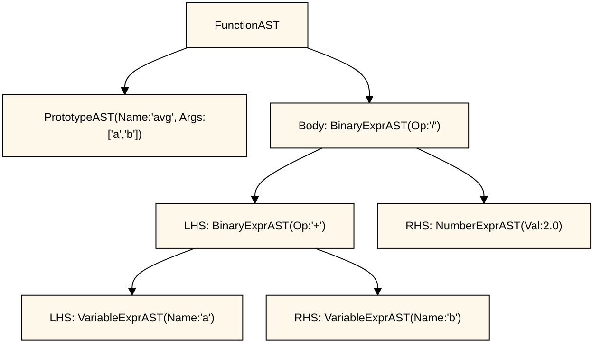

# 2. Pyxc: Parser and AST

## What We're Building

In Chapter 1, we built a lexer that chops source code into tokens. Now we need to understand what those tokens *mean*.

The lexer sees this:
```python
def add(x, y):
    return x + y
```

And produces this:
```bash
'def' identifier '(' identifier ',' identifier ')' ':' newline
'return' identifier '+' identifier newline
```

But that's just a stream of pieces. The parser's job is to understand the structure: "this is a function named `add` with two parameters, and its body adds them together."

We'll build that understanding as a tree structure called an Abstract Syntax Tree (AST).

## Source Code

Grab the code: [code/chapter02](https://github.com/alankarmisra/pyxc-llvm-tutorial/tree/main/code/chapter02)

Or clone the whole repo:
```bash
git clone https://github.com/alankarmisra/pyxc-llvm-tutorial
cd pyxc-llvm-tutorial/code/chapter02
```

## Grammar: The Language Blueprint

Before we parse, we need to know what we're parsing. A grammar defines the valid patterns.

Here's our grammar in EBNF notation:

```ebnf
program        = { mainloop }

mainloop       = definition
               | external
               | expression
               | newline

definition     = "def" prototype ":" expression
external       = "extern" "def" prototype
toplevelexpr   = expression
prototype      = identifier "(" [ identifier { "," identifier } ] ")"
expression     = primary { binoprhs }
primary        = identifierexpr
               | numberexpr
               | parenexpr
identifierexpr = identifier
               | identifier "(" [ expression { "," expression } ] ")"
numberexpr     = number
parenexpr      = "(" expression ")"
binoprhs       = binaryop primary

newline        = "\n"
binaryop       = "<" | ">" | "+" | "-" | "*" | "/" | "%"
identifier     = /[A-Za-z_][A-Za-z0-9_]*/
number         = /[0-9]+(\.[0-9]+)?/
```

### EBNF Quick Reference

- `"keyword"` - exact text
- `[ ... ]` - optional (zero or one)
- `{ ... }` - repeat (zero or more)
- `( ... )` - grouping
- `|` - or (pick one)
- `(* ... *)` - comment

## How the Parser Chooses

Look at this part of the grammar:

```ebnf
mainloop = definition
         | external
         | expression
```

How does the parser know which one to parse?

It looks at the first token:

- `def` → definition
- `extern` → external
- identifier, number, or `(` → expression

Each option starts with a different token, so the parser can decide immediately. This is called LL(1) parsing (one token lookahead).

## Avoiding Left Recursion

Don't write grammar rules like this:

```ebnf
thing = thing "+" other_thing
```

This creates infinite recursion. The parser tries to parse `thing`, which requires parsing `thing`, which requires parsing `thing`...

Our grammar avoids this. We use iteration instead:

```ebnf
expression = primary { binoprhs }
```

This means "parse one primary, then parse zero or more binoprhs."

## Trees Everywhere

An Abstract Syntax Tree (AST) is just a tree structure. If you've used a file system, you've seen trees:

```text
Documents/              ← Root
├── Photos/             ← Branch
│   ├── vacation.jpg    ← Leaf
│   └── family.jpg      ← Leaf
└── Code/               ← Branch
    ├── project/        ← Branch
    │   └── main.cpp    ← Leaf
    └── README.md       ← Leaf
```

An AST is the same concept. For code like this:

```python
def avg(a, b):
    return (a + b)/2.0
```

We get a tree like this:



The "root" is the function, "branches" are operations, and "leaves" are values like numbers and variable names.

## Why "Abstract"?

We drop syntax details that were only needed for parsing. Parentheses help group expressions while parsing, but once we've built the tree structure, we don't need the `(` and `)` tokens anymore. The tree structure *is* the grouping.

## AST Node Classes

Let's write the C++ classes for our AST nodes.

Base class for expressions:

```cpp
class ExprAST {
public:
  virtual ~ExprAST() = default;
};
```

Numbers:

```cpp
class NumberExprAST : public ExprAST {
  double Val;

public:
  NumberExprAST(double Val) : Val(Val) {}
};
```

Variables:

```cpp
class VariableExprAST : public ExprAST {
  string Name;

public:
  VariableExprAST(const string &Name) : Name(Name) {}
};
```

Binary operators:

```cpp
class BinaryExprAST : public ExprAST {
  char Op;
  unique_ptr<ExprAST> LHS, RHS;

public:
  BinaryExprAST(char Op, unique_ptr<ExprAST> LHS,
                unique_ptr<ExprAST> RHS)
    : Op(Op), LHS(std::move(LHS)), RHS(std::move(RHS)) {}
};
```

Function calls:

```cpp
class CallExprAST : public ExprAST {
  string Callee;
  vector<unique_ptr<ExprAST>> Args;

public:
  CallExprAST(const string &Callee,
              vector<unique_ptr<ExprAST>> Args)
    : Callee(Callee), Args(std::move(Args)) {}
};
```

Function prototypes (signatures):

```cpp
class PrototypeAST {
  string Name;
  vector<string> Args;

public:
  PrototypeAST(const string &Name, vector<string> Args)
    : Name(Name), Args(std::move(Args)) {}

  const string &getName() const { return Name; }
};
```

Function definitions:

```cpp
class FunctionAST {
  unique_ptr<PrototypeAST> Proto;
  unique_ptr<ExprAST> Body;

public:
  FunctionAST(unique_ptr<PrototypeAST> Proto,
              unique_ptr<ExprAST> Body)
    : Proto(std::move(Proto)), Body(std::move(Body)) {}
};
```

Each class captures one piece of the language. `NumberExprAST` holds a number, `BinaryExprAST` holds an operator and two sub-expressions, `FunctionAST` holds a prototype and a body expression.

## Parser Setup

We need a way to look ahead at the next token:

```cpp
static int CurTok;
static int getNextToken() {
  return CurTok = gettok();
}
```

Every parsing function assumes `CurTok` is the current token to process.

Type aliases for cleaner code:

```cpp
using ExprPtr = unique_ptr<ExprAST>;
using ProtoPtr = unique_ptr<PrototypeAST>;
using FuncPtr = unique_ptr<FunctionAST>;
```

Error reporting:

```cpp
template <typename T = void> T LogError(const char *Str) {
  const string TokStr = FormatTokenForError(CurTok);
  fprintf(stderr, "%sError%s: (Line: %d, Column: %d): %s near %s\n", Red, Reset,
          CurLoc.Line, CurLoc.Col, Str, TokStr.c_str());
  PrintErrorSourceContext(CurLoc);
  if constexpr (is_void_v<T>)
    return;
  else if constexpr (is_pointer_v<T>)
    return nullptr;
  else
    return T{};
}
```

This template handles errors for all return types. Call it with `LogError<ExprPtr>("message")` and it returns `nullptr`.

Format tokens for error messages:

```cpp
static string FormatTokenForError(int Tok) {
  if (Tok == tok_identifier)
    return "identifier '" + IdentifierStr + "'";
  if (Tok == tok_number)
    return "number '" + NumLiteralStr + "'";

  const auto TokIt = TokenNames.find(Tok);
  if (TokIt != TokenNames.end())
    return TokIt->second;
  return "unknown token";
}
```

Print source context:

```cpp
static void PrintErrorSourceContext(SourceLocation Loc) {
  const string *LineText = DiagSourceMgr.getLine(Loc.Line);
  if (!LineText)
    return;

  fprintf(stderr, "%s\n", LineText->c_str());

  int Spaces = Loc.Col - 1;
  if (Spaces < 0)
    Spaces = 0;
  for (int I = 0; I < Spaces; ++I)
    fputc(' ', stderr);
  fprintf(stderr, "%s^%s", Bold, Reset);
  fputc('~', stderr);
  fputc('~', stderr);
  fputc('~', stderr);
  fputc('\n', stderr);
}
```

This prints the source line and a caret pointing to the error.

## Parsing Expressions

### Numbers

```cpp
static unique_ptr<ExprAST> ParseNumberExpr() {
  auto Result = make_unique<NumberExprAST>(NumVal);
  getNextToken(); // consume the number
  return std::move(Result);
}
```

When we see a number token, create a `NumberExprAST` and advance to the next token.

### Parentheses

```cpp
static unique_ptr<ExprAST> ParseParenExpr() {
  getNextToken(); // eat (
  auto V = ParseExpression();
  if (!V)
    return nullptr;

  if (CurTok != ')')
    return LogError<ExprPtr>("expected ')'");
  getNextToken(); // eat )

  return V;
}
```

Parse what's inside the parentheses, check for the closing `)`, then return the inner expression. We don't create a node for parentheses—they were just grouping syntax.

### Variables and Calls

```cpp
static unique_ptr<ExprAST> ParseIdentifierExpr() {
  string IdName = IdentifierStr;

  getNextToken();  // eat identifier

  if (CurTok != '(') // simple variable ref
    return make_unique<VariableExprAST>(IdName);

  // Call
  getNextToken();  // eat (
  vector<unique_ptr<ExprAST>> Args;
  if (CurTok != ')') {
    while (true) {
      if (auto Arg = ParseExpression())
        Args.push_back(std::move(Arg));
      else
        return nullptr;

      if (CurTok == ')')
        break;

      if (CurTok != ',')
        return LogError<ExprPtr>("Expected ')' or ',' in argument list");
      getNextToken();
    }
  }

  getNextToken(); // eat )

  return make_unique<CallExprAST>(IdName, std::move(Args));
}
```

After seeing an identifier, check if `(` follows. If not, it's a variable. If yes, it's a function call—parse the arguments and create a `CallExprAST`.

### Primary Expressions

```cpp
static unique_ptr<ExprAST> ParsePrimary() {
  switch (CurTok) {
  case tok_identifier:
    return ParseIdentifierExpr();
  case tok_number:
    return ParseNumberExpr();
  case '(':
    return ParseParenExpr();
  default:
    return LogError<ExprPtr>("unknown token when expecting an expression");
  }
}
```

Dispatch to the right parser based on the current token.

## Binary Operators and Precedence

Binary expressions can be ambiguous. Does `x+y*z` mean `(x+y)*z` or `x+(y*z)`?

Math says `*` before `+`, so we need precedence:

```cpp
static map<char, int> BinopPrecedence = {
    {'<', 10}, {'>', 10}, {'+', 20}, {'-', 20}, {'*', 40}, {'/', 40}, {'%', 40}};
```

Higher numbers mean tighter binding. `*`, `/`, and `%` bind tighter than `+` and `-`, which bind tighter than `<` and `>`.

> **Note:** You might notice we're missing common operators like `==`, `<=`, `and`, and `or`. We'll add these in later chapters along with control flow (if/else, while), since comparison operators are most useful when you can actually act on the results! For now, we're focused on building the foundational parser infrastructure.

Helper function:

```cpp
static constexpr int NO_OP_PREC = -1;
static constexpr int MIN_BINOP_PREC = 1;

static int GetTokPrecedence() {
  if (!isascii(CurTok))
    return NO_OP_PREC;

  int TokPrec = BinopPrecedence[CurTok];
  if (TokPrec < MIN_BINOP_PREC)
    return NO_OP_PREC;
  return TokPrec;
}
```

Returns the precedence of the current token, or `NO_OP_PREC` if it's not a binary operator.

## Parsing Binary Expressions

Top-level expression parser:

```cpp
static unique_ptr<ExprAST> ParseExpression() {
  auto LHS = ParsePrimary();
  if (!LHS)
    return nullptr;

  return ParseBinOpRHS(MIN_BINOP_PREC, std::move(LHS));
}
```

Parse the first operand, then hand off to `ParseBinOpRHS` to handle operators.

The core algorithm:

```cpp
static unique_ptr<ExprAST> ParseBinOpRHS(int MinimumPrec,
                                              unique_ptr<ExprAST> LHS) {
  while (true) {
    int TokPrec = GetTokPrecedence();

    if (TokPrec < MinimumPrec)
      return LHS;

    int BinOp = CurTok;
    getNextToken(); // eat operator

    auto RHS = ParsePrimary();
    if (!RHS)
      return nullptr;

    int NextPrec = GetTokPrecedence();
    if (TokPrec < NextPrec) {
      // NextPrec binds tighter, so parse everything with precedence > TokPrec
      // The +1 ensures we don't consume operators at TokPrec level (left-associative)
      const int HigherPrecThanCurrent = TokPrec + 1;
      RHS = ParseBinOpRHS(HigherPrecThanCurrent, std::move(RHS));
      if (!RHS)
        return nullptr;
    }

    LHS = make_unique<BinaryExprAST>(BinOp, std::move(LHS), std::move(RHS));
  }
}
```

This is a precedence-climbing algorithm. Here's how it works:

**For `a`:**
- Parse `a` as primary
- No operator follows
- Return `a`

**For `a + b * c + d`:**

1. Parse `a`, operator is `+`
2. Parse `b`, lookahead is `*`
3. `*` has higher precedence than `+`, so recurse
4. Build `b * c`
5. Return to outer level, build `a + (b*c)`
6. Continue loop, parse `+ d`
7. Build `(a + (b*c)) + d`

The recursion happens when the next operator has higher precedence than the current one.

## Parsing Prototypes

```cpp
static unique_ptr<PrototypeAST> ParsePrototype() {
  if (CurTok != tok_identifier)
    return LogError<ProtoPtr>("Expected function name in prototype");

  string FnName = IdentifierStr;
  getNextToken();

  if (CurTok != '(')
    return LogError<ProtoPtr>("Expected '(' in prototype");

  vector<string> ArgNames;
  while (getNextToken() == tok_identifier) {
    ArgNames.push_back(IdentifierStr);
    getNextToken(); // eat identifier

    if (CurTok == ')')
      break;

    if (CurTok != ',')
      return LogError<ProtoPtr>("Expected ')' or ',' in parameter list");
  }

  if (CurTok != ')')
    return LogError<ProtoPtr>("Expected ')' in prototype");

  getNextToken(); // eat )

  return make_unique<PrototypeAST>(FnName, std::move(ArgNames));
}
```

Parse the function name, then the parameter list.

## Parsing Definitions

```cpp
static unique_ptr<FunctionAST> ParseDefinition() {
  getNextToken(); // eat def

  auto Proto = ParsePrototype();
  if (!Proto)
    return nullptr;

  if (CurTok != ':')
    return LogError<FuncPtr>("Expected ':' in function definition");
  getNextToken(); // eat ':'

  while (CurTok == tok_eol)
    getNextToken();

  if (CurTok != tok_return)
    return LogError<FuncPtr>("Expected 'return' before return expression");
  getNextToken(); // eat return

  if (auto E = ParseExpression())
    return make_unique<FunctionAST>(std::move(Proto), std::move(E));
  return nullptr;
}
```

Parse the prototype, expect `:`, skip newlines, expect `return`, then parse the expression.

## Parsing Externs

```cpp
static unique_ptr<PrototypeAST> ParseExtern() {
  getNextToken(); // eat extern
  if (CurTok != tok_def)
    return LogError<ProtoPtr>("Expected `def` after extern.");
  getNextToken(); // eat def
  return ParsePrototype();
}
```

`extern` declarations are just prototypes with no body.

## Top-Level Expressions

```cpp
static unique_ptr<FunctionAST> ParseTopLevelExpr() {
  if (auto E = ParseExpression()) {
    auto Proto = make_unique<PrototypeAST>("__anon_expr", vector<string>());
    return make_unique<FunctionAST>(std::move(Proto), std::move(E));
  }
  return nullptr;
}
```

Wrap standalone expressions in an anonymous function so we can evaluate them.

## Error Recovery

```cpp
static void SynchronizeToLineBoundary() {
  while (CurTok != tok_eol && CurTok != tok_eof)
    getNextToken();
}

static void HandleDefinition() {
  if (ParseDefinition()) {
    if (CurTok != tok_eol && CurTok != tok_eof) {
      string Msg = "Unexpected " + FormatTokenForMessage(CurTok);
      LogError<void>(Msg.c_str());
      SynchronizeToLineBoundary();
      return;
    }
    fprintf(stderr, "Parsed a function definition\n");
  } else {
    SynchronizeToLineBoundary();
  }
}
```

When parsing fails, skip to the end of the line so leftover tokens don't cause cascading errors.

## The Main Loop

```cpp
static void MainLoop() {
  while (true) {
    if (CurTok == tok_eof)
      return;

    fprintf(stderr, "ready> ");
    switch (CurTok) {
    case tok_eol:
      getNextToken();
      continue;
    case tok_def:
      HandleDefinition();
      break;
    case tok_extern:
      HandleExtern();
      break;
    default:
      HandleTopLevelExpression();
      break;
    }
  }
}
```

Read input, dispatch to the right parser, print success or error, repeat.

## Compile and Run

```bash
cd code/chapter02
cmake -S . -B build -DCMAKE_EXPORT_COMPILE_COMMANDS=ON && cmake --build build
./build/pyxc
```

Or use the shortcut:
```bash
cd code/chapter02
./build.sh
```

## Sample Session

```python
$ build/pyxc
ready> def foo(x,y): return x+foo(y, 4.0)
Parsed a function definition.
ready> def foo(x,y): return x+y y
Error: (Line: 2, Column: 26): Unexpected identifier 'y'
def foo(x,y): return x+y y
                         ^~~~
ready> 10 + 20
Parsed a top-level expr
ready> extern def sin(a)
Parsed an extern
ready> ^D
```

## What We Built

- **Grammar** - Formal definition of valid Pyxc syntax
- **AST classes** - Represent code structure as a tree
- **Recursive descent parser** - Converts tokens to AST
- **Precedence climbing** - Handles operator precedence correctly
- **Error recovery** - Provides clear error messages and continues parsing

With under 600 lines of code, we have a working parser that validates Pyxc syntax and builds a structured representation of the code.

## What's Next

The parser understands code structure, but doesn't execute anything yet. In Chapter 5, we'll generate LLVM IR from the AST—the first step toward actually running Pyxc code.

## Need Help?

Stuck? Questions? Errors?

- **Issues:** [GitHub Issues](https://github.com/alankarmisra/pyxc-llvm-tutorial/issues)
- **Discussions:** [GitHub Discussions](https://github.com/alankarmisra/pyxc-llvm-tutorial/discussions)
- **Contribute:** Pull requests welcome!

Include:
- Chapter number
- Your OS/platform
- Full error message
- What you tried
